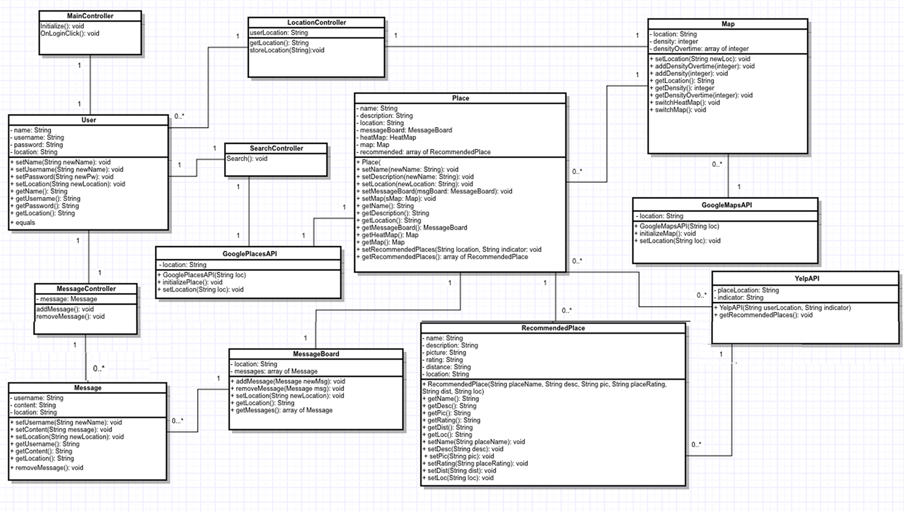
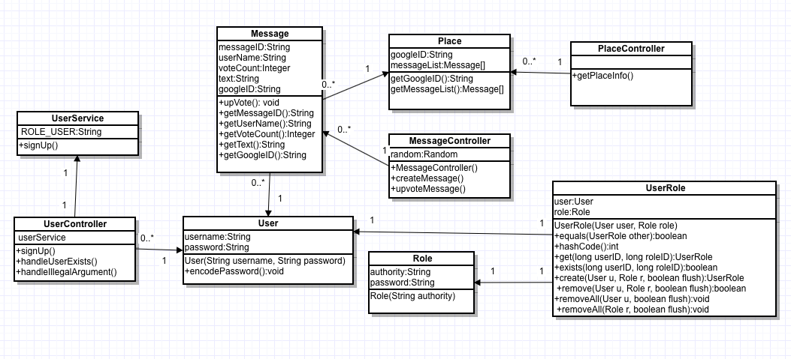

## [Home](https://ssajnani.github.io/Capacity/homepage.html) | [Team Roster](https://ssajnani.github.io/Capacity/teamPage.html) | [Software Design](https://ssajnani.github.io/Capacity/softwaredesign.html) | [UI Design](https://ssajnani.github.io/Capacity/uidesign.html) | [Project Plan](https://ssajnani.github.io/Capacity/projectplan.html)

# Software Design 

## Unified Modeling Language Diagram

This is the current UML diagram for our project with model and controller classes.

This is our UML diagram for Stage 2 with our model and controller classes.

These diagrams were created using Gliffy and edited using Adobe Photoshop.

<a href="#top">Back to Top</a>

